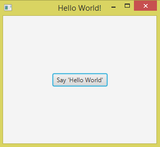

# Hello JavaFX

> "1000 langkah bermula dari satu langkah pertama"

Macam biasa, jika kita jumpa teknologi baru kita akan cuba bina program
yang paling simple iaitu memaparkan `Hello, World!`.

Untuk membuat program JavaFX menggunakan Netbeans, klik `File`
kemudian `New Project`. Pilih kategori `JavaFX` dan pilih projek
`JavaFX Application`. Selepas klik `Next`, kita diberi pilihan untuk
menamakan nama projek kita. Namakan projek tersebut apa-apa sahaja, jadi
sebagai contoh kita namakan projek ini sebagai `HelloJavaFX`.

Setelah selesai, kita akan dapat projek dengan file seperti ini:

```java
package hellojavafx;

import javafx.application.Application;
import javafx.event.ActionEvent;
import javafx.event.EventHandler;
import javafx.scene.Scene;
import javafx.scene.control.Button;
import javafx.scene.layout.StackPane;
import javafx.stage.Stage;

public class HelloJavaFX extends Application {

    @Override
    public void start(Stage primaryStage) {
        Button btn = new Button();
        btn.setText("Say 'Hello World'");
        btn.setOnAction(new EventHandler<ActionEvent>() {
            @Override
            public void handle(ActionEvent event) {
                System.out.println("Hello World!");
            }
        });

        StackPane root = new StackPane();
        root.getChildren().add(btn);

        Scene scene = new Scene(root, 300, 250);

        primaryStage.setTitle("Hello World!");
        primaryStage.setScene(scene);
        primaryStage.show();
    }

    /**
     * @param args the command line arguments
     */
    public static void main(String[] args) {
        launch(args);
    }

}
```

Selepas run, akan keluar GUI seperti berikut:



Jika kita klik _button_ tersebut, akan terpapar `Hello World!` di
terminal.

Tahniah, anda telah berjaya membuat GUI menggunakan JavaFX!

Sekarang kita akan lihat apa yang sebenarnya berlaku pada code tersebut.

## Control

_Control_ (atau _widget_) ialah benda yang membolehkan interaksi antara
user dengan program. Contohnya _button_, tempat untuk menulis text
(_text field_), tempat untuk melukis (_canvas_), dan sebagainya. Kita
boleh create _control_ dengan cara create object untuk _control_
tersebut seperti code di atas.

_Control_ merupakan class jadi setiap _control_ mempunyai _method_ yang
tersendiri. Contoh seperti di atas, kita menggunakan method
`setText()` untuk menentukan text yang tertulis pada _button_
tersebut.

## EventHandler

_EventHandler_ ialah code yang kita letakkan pada sesebuah control.
Tugasnya ialah menunggu interaksi daripada user. Selepas user
berinteraksi dengannya, maka dia akan melaksanakan code yang ditugaskan.
Contoh di atas, _EventHandler_ tersebut menunggu user untuk tekan
_button_ tersebut. Selepas ditekan, _EventHandler_ akan paparkan `Hello
World!`.

## Pane

Control tidak boleh tergantung di skrin begitu sahaja. Control
memerlukan tapak untuk diletakkan. Tapak ini disebut sebagai _Pane_.
Dalam JavaFX ada pelbagai jenis Pane. Contoh di atas, kita menggunakan
_StackPane_ sebagai tapak kepada _button_ tersebut. Kita boleh
menggunakan,

```java
pane.getChildren().add(control);
```

untuk menambah control pada _Pane_ tersebut.

## Stage dan Scene

JavaFX menggunakan konsep _Stage_ (pentas) dan _Scene_ (babak).

Contohnya di lakonan teater, lakonan tersebut berada di atas satu
pentas, dan dibahagikan kepada beberapa babak. Setiap babak mempunyai
prop yang berlainan.

Dalam JavaFX juga sama, satu program boleh berada di atas satu program
window, dan boleh dibahagikan kepada beberapa scene. Setiap scene
mempunyai control yang berlainan.

Contoh code di atas, kita hanya menggunakan satu _stage_ dan satu
_scene_ sahaja.
